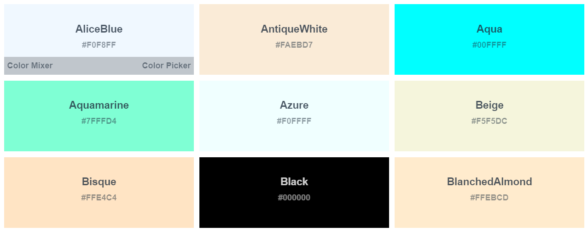
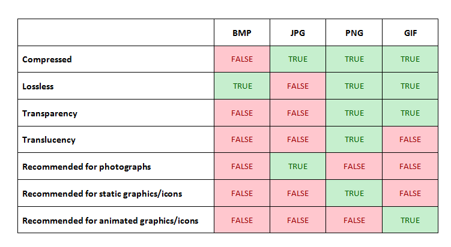
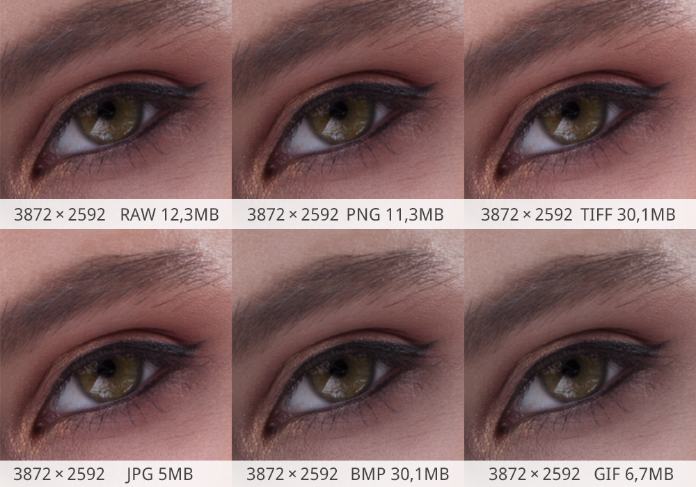
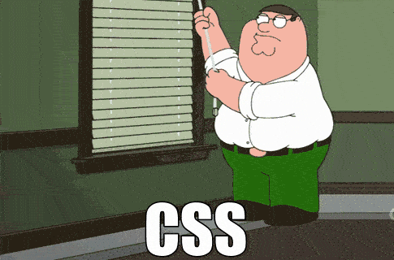

# Class 5

## **HTML Images**

- Images are not inserted into web pages 
- images are linked 'src' to web pages. 
- The  creates a holding space for the referenced image.

**We Use**

```html

```

the `alt=" text " ` also used in some sites that have accessabily option for those with seeing disabilities . 
browser can read the text of the `alt` attribute value to the navigator.

## **HTML Colors**

modern browsers supports 140 color names. we can use color name , every color name has a hex value to view the color on the webpage.

>

**Text color**

in css `color ` property is used to set the color of the text.

we can use : 
* Color name.
* Color HEX value.
* Color RGB value .

**Examples**

```css
body {
  background-color: lightgrey;
  color: blue;
}

h1 {
  background-color: #D3D3D3;
  color: #0000FF;
}
h2 {
  background-color: #rgb(211, 211, 211)
  color: rgb(0, 0, 255);
}
```

> all of the above has the same color for background and text , in body usiung the color name , in h1 using the HEX code for the same color name and  in h2 used RGB "RED|GREEN|BLUE" values of the same color names. 

---

## JPEG vs PNG vs GIF

alot of image format exists , each has a specific use .

>

most common used formats in web and mobile applications are 

- JPEG, PNG and GIF.

these formats or extentions defere from each other alot what makes each one of them suitable for specific use case.

* JPEG format used in images of natural scene for smoother intensity in colors.

* PNG in used where ever transparency needed.
* GIF format used with images containing animations.

**below table shows diffrences between alot of image file types and extentions.**

>


**example**

>


# Css Meme as an example of a GIF picture

>


[**Back**](https://odehabuzaid.github.io/reading-notes/)                     | [**TOP**](##HTML-Images) |